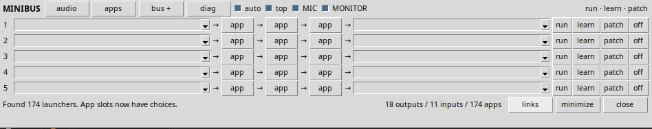

<p align="center">
  
</p>

<h1 align="center">MINIBUS Lite</h1>

<p align="center">
  Compact cross-platform desktop audio routing control panel for PipeWire, WASAPI, and CoreAudio workflows.
</p>

<p align="center">
  <a href="#overview">Overview</a> ·
  <a href="#features">Features</a> ·
  <a href="#platform-support">Platform Support</a> ·
  <a href="#install">Install</a> ·
  <a href="#run">Run</a> ·
  <a href="#deploy">Deploy</a> ·
  <a href="#troubleshooting">Troubleshooting</a>
</p>

<p align="center">
  
  
  
  
  
  
</p>

---

## Overview

**MINIBUS Lite** is a compact desktop-corner audio patch panel for lane-based routing workflows.

It is designed as a **control plane**, not a Python audio engine. MINIBUS does not process audio itself. On Linux, it controls PipeWire links directly. On Windows and macOS, it provides audio-device discovery, diagnostics, app launching, and virtual-device-assisted route tracking for workflows that use tools such as VB-CABLE, Voicemeeter, BlackHole, Loopback, or similar virtual audio drivers.

Current release: **v0.4.1**  
Runtime: **Python 3 + Tkinter**  
Primary backend: **Linux PipeWire**  
Preview backends: **Windows WASAPI**, **macOS CoreAudio**  
License: **MIT**

---

## Key Positioning

MINIBUS has three routing modes:

| Platform | Routing level | Status |
|---|---:|---|
| Linux / PipeWire | Native patching | Supported |
| Windows / WASAPI | Discovery + virtual-device route tracking | Preview |
| macOS / CoreAudio | Discovery + virtual-device route tracking | Preview |

Linux/PipeWire is the only backend that currently performs native link creation and removal.

Windows and macOS do not expose a PipeWire-style public graph that MINIBUS can link with one command. On those platforms, MINIBUS can track routes that include an external virtual audio device, while the virtual driver performs the actual audio forwarding.

---

## Features

- Compact five-lane audio patch panel.
- Native PipeWire patching on Linux.
- PipeWire link creation and removal.
- PipeWire virtual bus creation.
- Learn mode for detecting newly created audio ports.
- MIC and MONITOR route controls for MINIBUS-managed links.
- Windows WASAPI endpoint discovery.
- macOS CoreAudio device discovery.
- Windows Start Menu and Program Files launcher discovery.
- macOS `.app` launcher discovery.
- AppImage and Wine `.exe` discovery on Linux.
- Virtual-device route tracking on Windows/macOS.
- Local diagnostics from the UI.
- Terminal diagnostics script.
- Persistent lane, window, and routing state.
- No Rust, Node, npm, Tauri, or build system required.

---

## Platform Support

| Platform | Status | Support |
|---|---:|---|
| Linux Mint | Supported | Full PipeWire support |
| Ubuntu / Debian | Supported | Full support with PipeWire and Tkinter |
| Fedora | Supported | Full support with PipeWire and Tkinter |
| Arch / Manjaro | Supported | Full support with PipeWire and Tkinter |
| Other PipeWire Linux | Likely | Run diagnostics first |
| Linux PulseAudio only | Not supported | Use PipeWire/Pulse compatibility |
| Linux JACK only | Not supported | Use PipeWire/JACK compatibility |
| Windows | Preview | WASAPI discovery and virtual-device route tracking |
| macOS | Preview | CoreAudio discovery and virtual-device route tracking |

---

## Routing Model

### Linux

On Linux, MINIBUS uses PipeWire command-line tools:

```text
pw-link -o                 list output/source ports
pw-link -i                 list input/destination ports
pw-link SOURCE DEST        create a link
pw-link -d SOURCE DEST     remove a link
pw-loopback                create a virtual bus
pw-dump                    graph diagnostics
```

This gives MINIBUS real patch/off behavior on PipeWire systems.

### Windows and macOS

On Windows and macOS, MINIBUS discovers available audio endpoints and can track routes that use virtual audio devices.

Typical Windows route:

```text
App output → VB-CABLE / Voicemeeter → Recorder / Processor
```

Typical macOS route:

```text
App output → BlackHole / Loopback → Recorder / Processor
```

Important distinction:

```text
MINIBUS tracks the route.
The virtual audio driver forwards the audio.
```

Native arbitrary app-to-app routing on Windows/macOS is not implemented yet.

---

## Install

### Linux Mint / Ubuntu / Debian

```bash
sudo apt update
sudo apt install -y python3-tk pipewire-bin wireplumber
```

### Fedora

```bash
sudo dnf install -y python3-tkinter pipewire-utils wireplumber
```

### Arch / Manjaro

```bash
sudo pacman -S --needed tk pipewire wireplumber
```

### Windows

Install Python 3 from either:

- Microsoft Store
- python.org

During installation, enable **Add Python to PATH** if available.

### macOS

Install Python 3 with Tkinter support.

Optional helper for cleaner CoreAudio device listing:

```bash
brew install switchaudio-osx
```

---

## Run

### Linux / macOS

```bash
python3 minibus.py
```

Or, on Linux/macOS:

```bash
./run.sh
```

### Windows

```powershell
py minibus.py
```

---

## Diagnostics

Run diagnostics before opening an issue:

### Linux / macOS

```bash
python3 diagnose_minibus.py
python3 -m unittest discover -s tests -v
```

### Windows

```powershell
py diagnose_minibus.py
py -m unittest discover -s tests -v
```

Diagnostics check:

- Python version.
- Tkinter availability.
- Active backend.
- Linux PipeWire tools and services.
- Windows WASAPI endpoint discovery.
- macOS CoreAudio device discovery.
- Virtual audio endpoint detection.
- Launcher discovery.
- Core unit tests.

---

## Basic Workflow

### Linux / PipeWire

```text
Choose app → Run app → Start audio → Learn port → Select destination → Patch
```

Use `off` to remove a MINIBUS-created route.

### Windows / macOS with virtual audio devices

```text
Install virtual audio driver → Refresh audio devices → Select virtual endpoint → Patch
```

Supported virtual-device keywords include:

```text
VB-CABLE
Voicemeeter
BlackHole
Loopback
Virtual Cable
```

If neither endpoint appears to be a virtual audio device, MINIBUS will report that native WASAPI/CoreAudio patching is not implemented.

---

## Configuration

MINIBUS stores user state in the platform config directory:

```text
Linux:   ~/.config/minibus/config.json
macOS:   ~/Library/Application Support/MINIBUS/config.json
Windows: %APPDATA%\MINIBUS\config.json
```

Saved state includes:

- Window position.
- Lane source and destination selections.
- Selected launchers.
- MIC state.
- MONITOR state.
- Topmost setting.
- Auto-refresh setting.

Reset state:

### Linux

```bash
rm -f ~/.config/minibus/config.json
```

### macOS

```bash
rm -f "$HOME/Library/Application Support/MINIBUS/config.json"
```

### Windows PowerShell

```powershell
Remove-Item "$env:APPDATA\MINIBUS\config.json" -ErrorAction SilentlyContinue
```

---

## Deploy

A clean release package should include:

```text
README.md
LICENSE
.gitignore
minibus.py
diagnose_minibus.py
install.sh
run.sh
install_desktop_launcher.sh
tests/test_minibus_core.py
MINIBUS.png
```

It should not include:

```text
__pycache__/
.pytest_cache/
.git/
*.pyc
local config files
build output
```

Build a clean release zip from the parent folder:

```bash
zip -r minibus-lite-v0.4.1.zip minibus-lite-v0.4.1 \
  -x '*/__pycache__/*' '*/.git/*' '*.pyc' '*/.pytest_cache/*'
```

Recommended pre-release checks:

```bash
python3 -m py_compile minibus.py diagnose_minibus.py
python3 -m unittest discover -s tests -v
python3 diagnose_minibus.py
```

For Windows:

```powershell
py -m unittest discover -s tests -v
py diagnose_minibus.py
```

---

## Troubleshooting

### No ports are visible on Linux

Check PipeWire and WirePlumber:

```bash
pw-link -o
pw-link -i
systemctl --user status pipewire wireplumber
python3 diagnose_minibus.py
```

Do not run MINIBUS with `sudo`. PipeWire desktop audio normally runs inside the user session.

### App does not appear in audio ports

Start playback or enable the app’s audio engine. Many applications do not create audio ports while idle.

Then press:

```text
audio
learn
```

### Windows/macOS route does not produce audio

Check that the route includes a real virtual audio device such as VB-CABLE, Voicemeeter, BlackHole, or Loopback.

MINIBUS tracks the route. The external virtual audio driver must be installed and selected inside the source or target application.

### AppImage does not launch

Make it executable:

```bash
chmod +x /path/to/App.AppImage
```

Then test it directly:

```bash
/path/to/App.AppImage
```

### Windows `.exe` does not launch on Linux

Install Wine and test the app outside MINIBUS:

```bash
wine /path/to/app.exe
```

---

## Repository Structure

```text
README.md
LICENSE
.gitignore
MINIBUS.png
minibus.py
diagnose_minibus.py
install.sh
run.sh
install_desktop_launcher.sh
tests/
  test_minibus_core.py
```

---

## Development

Run checks locally:

```bash
python3 -m py_compile minibus.py diagnose_minibus.py
python3 -m unittest discover -s tests -v
python3 diagnose_minibus.py
```

Good contribution areas:

- Friendlier audio port names.
- Favourites in the app chooser.
- Per-lane auto-reconnect.
- Better link inspector.
- Named scene save/load.
- Stronger virtual bus management.
- Dedicated backend modules.
- Native Windows WASAPI routing.
- Native macOS CoreAudio routing.

---

## Roadmap

Near-term:

- Cleaner source/destination naming.
- Better visible route inspector.
- Named scene save/load.
- Stronger virtual-device workflow documentation.
- Backend module separation.

Long-term:

- Native Windows WASAPI routing backend.
- Native macOS CoreAudio routing backend.
- Expanded virtual-driver integration.
- Consistent lane UI and config format across all supported platforms.

---

## License

MIT License. See `LICENSE`.
